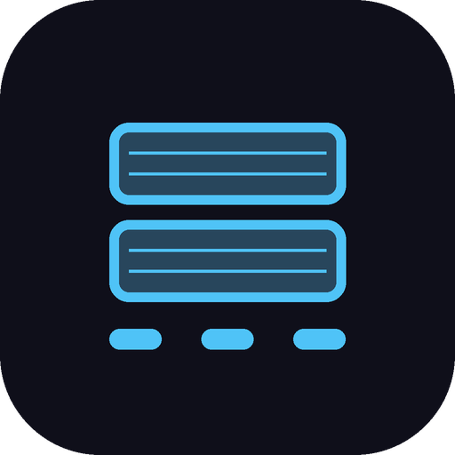
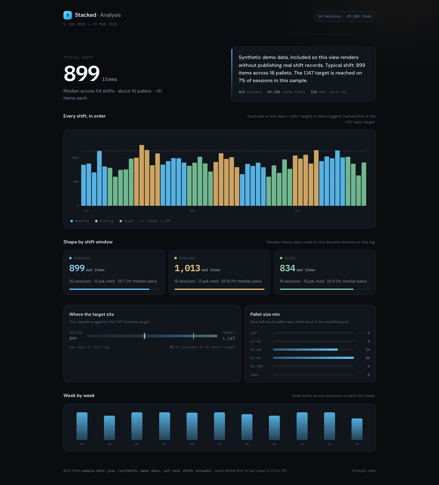

<p align="center">
  
</p>

<h1 align="center">Stacked</h1>

<p align="center"><strong>Log pallets, track items/hr, and manage rotating warehouse shifts. No login required.</strong></p>

<p align="center">
  
</p>

---

Stacked is an intuitive productivity log tool for warehouse pickers, packers, and loaders to track shift output and items per hour on their own terms.

It was built to replace paper notes and text apps with an instant, floor-optimized workflow. You record each completed pallet with a quick-tap numeric layout, logging work efficiently so you can get straight back to your task.

Android app with iOS scaffolded. Package id `com.saicharan.stacked`. Currently in pilot.

## How it works

1. Tap the item count as you wrap and complete each pallet.
2. The app logs the pallet instantly and timestamps it.
3. Stacked automatically detects whether you are working a Morning, Evening, or Night shift based on the time.

## Track your hourly pace

See how you are performing across the shift, day, week, and month.

- **Pallet count:** Exactly how many pallets you have completed.
- **Items/hour:** Your live hourly pace (items divided by logged time span).
- **History:** Review previous shifts to verify completed hours, track personal milestones, and maintain accurate records.

## Built for rotating shifts

If you work a rotating pattern, set up your current and previous shifts and the app calculates your rotation (Morning to Night to Evening) so you can view your upcoming schedule seamlessly.

## Document what happened with notes

Add quick timestamped notes to a shift log (for example "dock delay", "forklift queue" or "system down") to record what happened during the shift.

## Your data, your choice

- **No accounts:** Open the app and use it immediately. No email, username, or login required.
- **Offline by default:** Logs, statistics, and notes are stored securely on your local device.
- **Optional sync:** You can opt in to sync shift summaries (pallets, items, hourly rate) anonymously to back up your stats. Your name, email, and notes text never leave your device.

## Key features

- Layout designed for fast, one-handed input on the floor.
- Automatic shift detection for Morning, Evening, and Night, including midnight crossings.
- Daily, weekly, and monthly statistics dashboards.
- Deterministic shift schedule predictor that matches standard rotating cycles.
- Swipe-to-delete with double confirmation to prevent accidental deletions on the floor.
- Data export and import to seamlessly transfer records to a new device.

---

## How performance numbers are calculated

Two metrics are reported, using different denominators by design to provide maximum clarity.

**Pace** is total items divided by the active logged span (first pallet to last pallet plus a 30-minute buffer). It measures actual active work time rather than a static 8-hour clock.

**Daily target** is `(8h - 50m break) x (1 - 20% operational buffer)`, which equals 5.733 productive hours at 200 items/hr, or approximately **1147 items**.

These metrics remain distinct so you can evaluate live active speed alongside full-shift target goals. The interface displays the formula alongside the calculation for total transparency.

Overtime classification uses the rostered shift window with a 15-minute grace period on either side. Entries within the window are tagged Regular, and entries outside are tagged Overtime. Manual override chips are always available. Full design documentation in [`docs/RIGID_SCHEDULE_GRACE.md`](docs/RIGID_SCHEDULE_GRACE.md).

The target arithmetic and schedule logic are fully covered in the test suite: [`test/pace_math_test.dart`](test/pace_math_test.dart), [`test/target_math_test.dart`](test/target_math_test.dart), [`test/roster_window_ot_test.dart`](test/roster_window_ot_test.dart), [`test/stops_pallet_test.dart`](test/stops_pallet_test.dart), [`test/storage_export_import_test.dart`](test/storage_export_import_test.dart).

## What optional sync sends

Sync is disabled by default. Opting in sends an aggregated shift summary: date, shift type, pallets, items, stops, derived pace, shift duration in hours, and an anonymous installation identifier.

Wall clock log timestamps are not included in the payload. Text notes are never included. Personal identity data (name, email, location) is never collected.

Aggregate reporting queries a summary view:

```sql
create or replace view shift_macro_summary_view as
select
  session_date,
  shift_type,
  count(distinct device_id) as active_pickers_sample,
  count(*)                  as total_sessions_logged,
  sum(total_items)          as total_items_picked,
  sum(pallets)              as total_pallets_logged,
  round(avg(items_per_hour_live)::numeric, 1) as avg_live_pace_items_per_hr,
  round(avg(duration_hours)::numeric, 2)      as avg_shift_span_hrs
from sessions
group by session_date, shift_type;
```

Schema details in [`site/supabase_schema.sql`](site/supabase_schema.sql).

## Analysis view

[`dashboard/index.html`](dashboard/index.html) is a standalone web view that reads an exported log file and renders shift, day, week and month breakdowns.



It ships with a synthetic demo dataset so it renders on open. Real shift records are not published here. Point it at your own export to see your own numbers.

## Build and release

```bash
flutter pub get
flutter analyze
flutter test
flutter run
```

Every push to `main` runs `flutter analyze` and `flutter test`. Workflow: [`.github/workflows/release.yml`](.github/workflows/release.yml).

Signed APK and AAB releases are cut from the private working repository, where the upload keystore lives. The keystore is injected at build time and is never committed to either repository.

To point the app at your own backend, replace `YOUR_PROJECT` and `YOUR_PUBLISHABLE_KEY` in [`lib/sync_service.dart`](lib/sync_service.dart) and run [`site/supabase_schema.sql`](site/supabase_schema.sql).

## Repository layout

| Path | Contents |
|---|---|
| [`lib/`](lib) | App source: models, storage, pace calculations, shift prediction, sync |
| [`test/`](test) | Test suite covering pace, target arithmetic, and schedule anchors |
| [`android/`](android), [`ios/`](ios) | Platform projects |
| [`dashboard/`](dashboard) | Standalone web analysis dashboard |
| [`site/`](site) | Pilot onboarding page and backend database schema |
| [`docs/`](docs) | Shift window and overtime classification design |
| [`play-store/`](play-store) | Store listing copy, data safety declarations, and rating info |
| [`.github/workflows/`](.github/workflows) | Continuous integration and release pipeline |

## Status

In pilot, moving through Play Internal Testing toward Closed Testing. The app is fully usable offline by anyone who never turns sharing on.

Privacy policy: [published document](https://docs.google.com/document/d/e/2PACX-1vQ026Pr-r13kJPYStsmu2bs2oQLVxF17Rw7rbgUVBUCOrHW08w6xlmaAMpGAKznNule2fgAfAIWZKAx/pub)

Built by [k-saicharan](https://github.com/k-saicharan).
